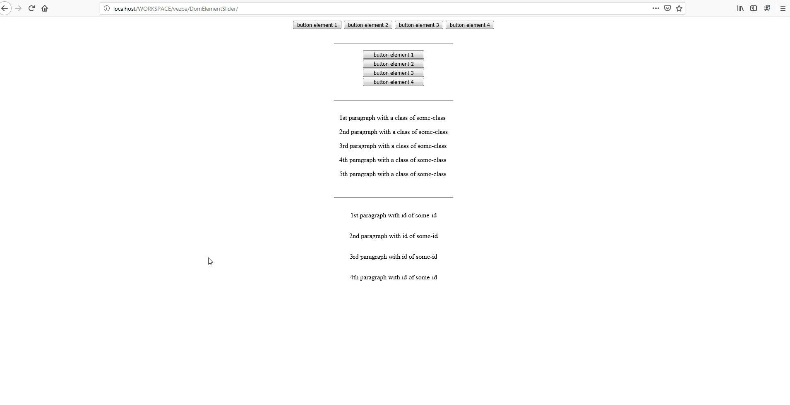
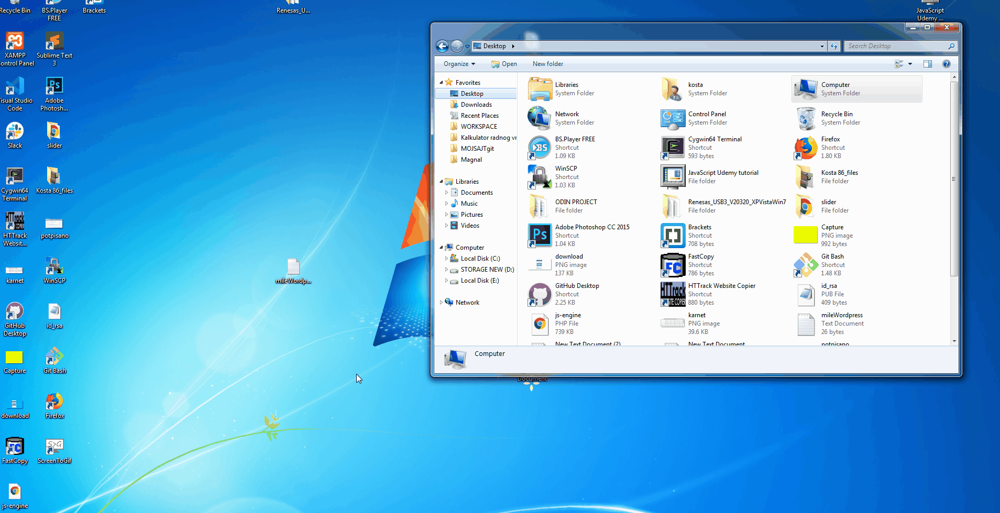
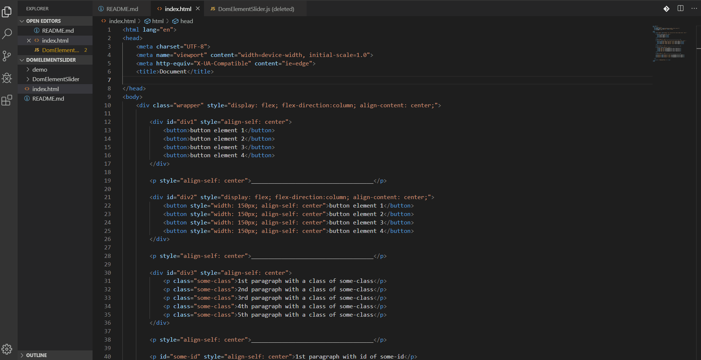
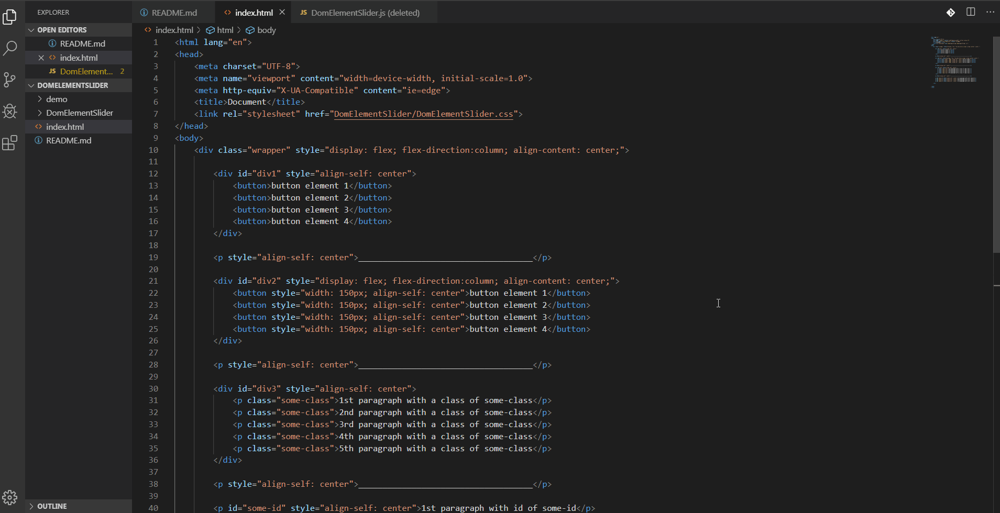
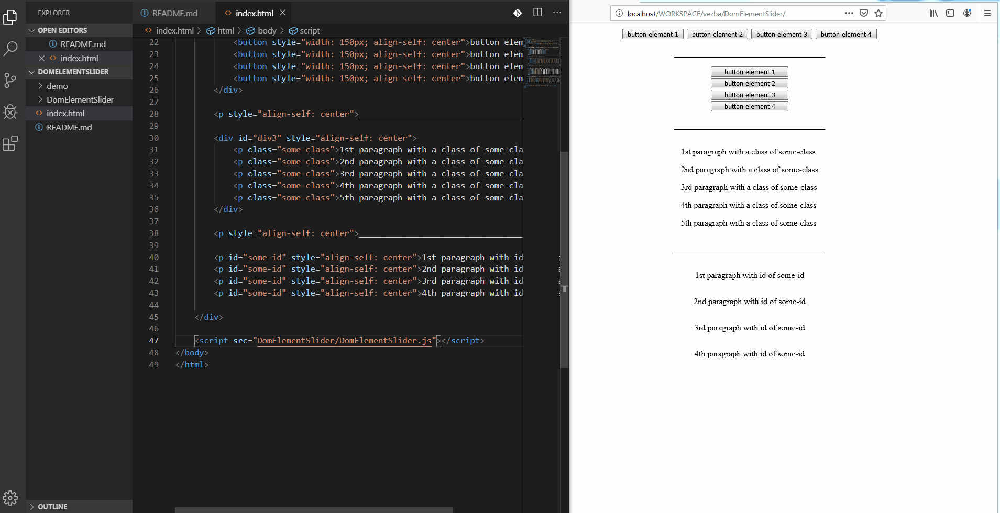

# DomElementSlider

DomElementSlider is used for making any of your HTML elements get a nice slide in effect on page load.

## Getting Started

### Installing

#### 1. Extract the <DomElementSlider> folder to your projects root folder.

#### 2. Include DomElementSlider.css file to your page.

#### 3. Include DomElementSlider.js file to your page.

#### 4. Go to .DomElementSlider.js and replace the '?' with:
##### 1. HTML element name(ex. 'button')
##### 2. ClassName of the element you want to slide in(ex. '.some-class')
##### 3. Id of the element you want to slide in(ex. '#some-id')

## Built With

JavaScript
CSS

## Versioning

V1.0.0 

## Authors

* **Kosta Jovanovic** - (https://github.com/kosta86)

## License

This project is licensed under the MIT License - see the [LICENSE.md](LICENSE.md) file for details

